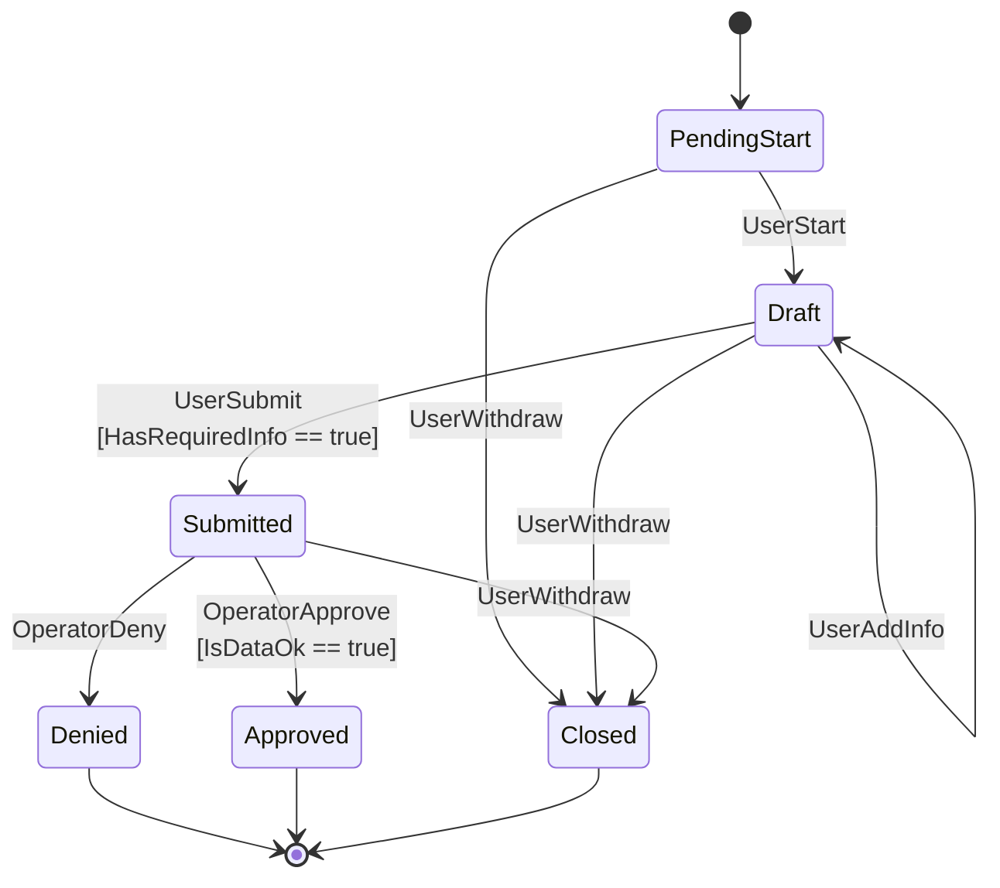

# State machine experiment

## Incipient idea

I wanted to do a hands-on exercise to understand the concept of state machine. I heard about the idea of state machine while working. I had a vague idea of what it meant, but I wanted to dive just a bit deeper into it and understand by experimenting.

## Definition

Put simply, a state machine, is a way to describe a system as a set of **states**, where it can only be in one state at a time. Between states, there are transitions that change the state of the system. The transitions are triggered by events, inputs, or even more generally, triggers. The most common type of state machine is the finite state machine (FSM), which means it's a state machine where the system can be in exactly one state at a time, a transition can lead from one state to another one in the exact same matter every time, and there is a finite set of states.

## Exercise

The exercise I chose was to build a finite state machine in the domain of insurance, specifically in the context of an insurance claim. Below is the diagram of the FSM:

